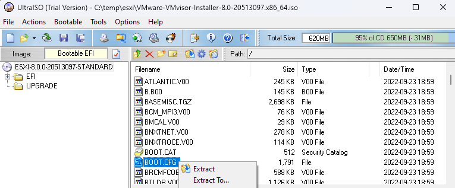
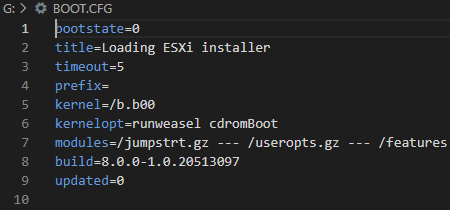
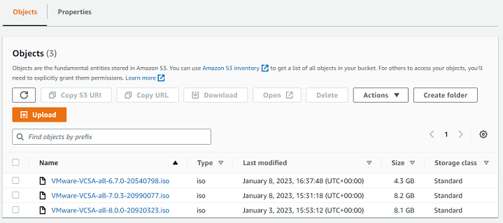
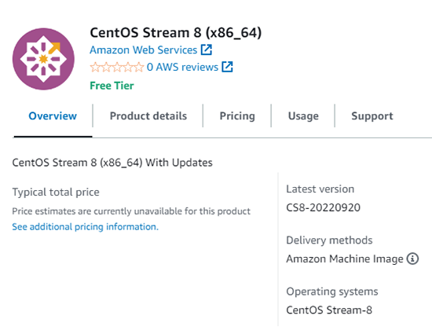
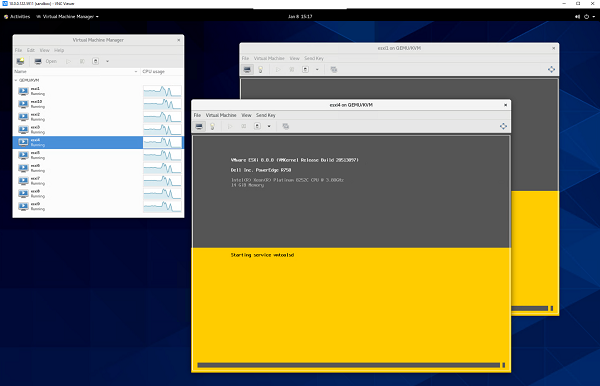

**Deployment Steps**
----
NOTE: I realize it is obnoxious to have to separately download these ISOs from VMware, but it would be illegal for me to distribute them myself.  

**1) Download the latest ESXi ISO for either 6.7, 7.0 or 8.0 VMware or the vExpert site**
----

Known good ESXi vmvisor installer ISOs

**6.7** = VMware-VMvisor-Installer-201912001-15160138.x86_64.iso

**7.0** = VMware-VMvisor-Installer-7.0U3g-20328353.x86_64.iso

**8.0** = VMware-VMvisor-Installer-8.0-20513097.x86_64.iso
        
**2) Download the latest VCSA ISO for either 6.7, 7.0, or 8.0 from VMware or the vExpert site**
----

Known good VCSA ISOs

**6.7** = VMware-VCSA-all-6.7.0-15132721.iso

**7.0** = VMware-VCSA-all-7.0.3-20990077.iso

**8.0** = VMware-VCSA-all-8.0.0-20920323.iso
  
    * Note: 7.0 is the pickiest of the bunch.  Make sure you use this build as earlier ones have odd SSL issues in the nested environment

**3) Modify the ESXi vmvisor installer ISOs to make them do an unattended/kickstart install**
----

*   Using a tool such as [UltraISO](https://www.ultraiso.com/), edit two files.  First is \BOOT.CFG and the second is \EFI\BOOT\BOOT.CFG.  

       

       

*   Both files are identical, and you need to make the same change to both files in all versions of the vmvisor ISO before uploading it to S3.
    * Change this line:
    * kernelopt=runweasel cdromBoot   

        
        
    * To look like this:
    * kernelopt=cdromBoot runweasel ks=http://192.168.20.1/KS.CFG

        

*   Save the files and name them something that clearly shows they are the modified ISOs.  
    *   I use this convention:

        

**4) Set up an S3 bucket**
----

*  Upload the VCSA ISOs for 6.7, 7.0, and 8.0 into it

    

    NOTE: You don't need all three like I have, just whichever one you are going to deploy

*  Upload the **modified ISOs** for ESXI 6.7, 7.0, and 8.0 into it

    

**5) Set up a VPC**
----

*  Give it two private and two public subnets (minimum)

    *   The two privates are needed because you will be deploying AWS Managed Active Directory, and that requires two domain controllers on different subnets

    *   The public subnets are needed for your NAT gateway and jump host

*   Deploy at least one NAT Gateway

*   Create two Routing Tables, one for the public and one for the private subnets

    *   Set the Private routing table to use the NAT Gateway as the route for 0.0.0.0/0

    *   Set the Public routing table to use the Internet Gateway as the route for 0.0.0.0/0

    *   Explicitly associate the private subnets to the private route table and the public subnets to the public route table
   
**6) Deploy an AWS Managed Active Directory instance into your VPC**
----

*  Note: The script uses admin@example.local by default.  This means you cant use Simple AD, it has to be the full Managed AD ... well, unless you want to hack the scripts

*  This also means you would be best served setting the DHCP options up for your VPC to point to these for DNS, not the default AWS DNS

    

**6) Deploy an Windows instance into your VPC to act as a jump host**
----

*  Put it on one of the public subnets and allow 3389 in from the internet

*  Join it to the Active Directory Domain you created in step 6

*  Install PuTTY or whatever SSH client you like

*  Install a VNC client such as RealVNC

**8) Deploy an m5zn.metal to your VPC to be the L0 host**
----

 *  Use the official Centos 8 Stream AMI from AWS

     

 *  Put it on one of the private subnets

**9) Under bash/userdata-example.sh there is something you can cut and paste into the user data section that will prepare the L0 host**
----

 *  Make sure to fill out the S3BUCKET, S3PREFIX, ADPASSWORD, etc variables at the top appropriately

     

    What these variables mean:

    *   **S3BUCKET=**
        *   *example:  S3BUCKET=mybucket*
        *   Don't include the https:// or s3:// or any of that.  Just the base bucket name
    *   **S3PREFIX=**
        *   *example:  S3PREFIX=myprefix*
        *   Don't include the "/" on either side
    *   **DNSIPADDRESS1=**
        *   *example:  DNSIPADDRESS1=10.0.0.111*
        *   This is the first IP address you got when you deployed AWS Managed AD
    *   **DNSIPADDRESS2=**
        *   *example:  DNSIPADDRESS2=10.0.0.74*
        *   This is the second IP address you got when you deployed AWS Managed AD
    *   **VCSAISO=**
        *   *example:  VCSAISO=VMware-VCSA-all-8.0.0-20920323.iso*
    *   **VSPHEREVERSION=**
        *   *example:  VSPHEREVERSION=8.0*
    *   **DNSDOMAIN=**
        *   *example:  DNSDOMAIN=example.local*
        *   This is your AD Domain name
    *   **ADPASSWORD=**
        *   *example:  ADPASSWORD=Aws2022@*
    *   **ADUSER=**
        *   *example:  ADUSER=admin@EXAMPLE.LOCAL*
        *   NOTE: The domain name needs to be in all caps.  Oddity of realmsd.

 *  This userdata script will 
  
    *  download this git repo to the L0
    *  download the ISOs for the VCSA and ESXi installers to the L0
    *  join the L0 to your Active Directory Domain
    *  inject the variables you set at the top into ./main.sh
    *  Run ./main.sh which prepares everything right up to the point before you start actually deploying ESX/VCSA/etc

**10) Once the EC2 baremetal instance is deployed, you need to make a couple of modifications to it**
----

 *  First, disable the source/dest check (under networking)

     

 *  Second, add a route for 192.168.0.0/16 that points to whatever ENI maps to eth0 of your EC2 instance

     

**11) From your Jump Host, SSH into your EC2 baremetal instance**
----

  *  cd /scripts/vmware-admin-scripts/esxi-on-kvm

  *  vi ./main.sh

      Edit the variables for the DNS IP Address 1 and 2, plus any others which are relevant to you

     

  *  Now kick off the build of the nested environment

      ./nested.sh

      **NOTE: This assumes you used the example userdata script to deploy the L0.  If you did not, you will need to manually run ./main.sh BEFORE ./nested.sh**

**12) From your Jump Host, VNC to the desktop of your EC2 baremetal instance**
----

  *  One of the scripts ./main.sh runs installs a GNOME desktop and VNC server onto the L0.  This is helpful for troubleshooting, as you can watch the ESXi host consoles while they build.

     

Tips
----
1.  **If you want to redeploy the nested environment without having to redeploy the entire instance:**

    *  bash/flush.sh
  
       *  This will remove all 10 ESXi VMs from KVM
  
    *  bash/build.sh
  
       *  This will recreate them plus install the VCSAs, nested VMs, configure DVSes, etc