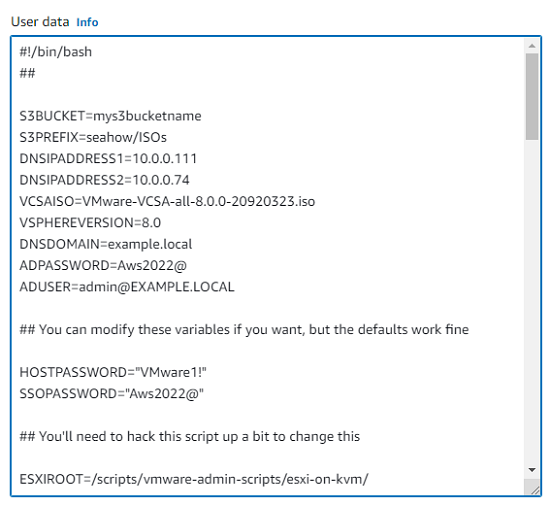

Steps
----
1.  Set up an S3 bucket
    a.  Download the VCSA for 6.7, 7.0, and 8.0 into it
    b.  Download the modified ISOs for ESXI 6.7, 7.0, and 8.0 into it
        c.  See the *MODIFYING ESXI ISOs* section that describes how make them do an automated Kickstart install from http://192.168.20.1/KS.CFG

2.  Set up a VPC
   
3.  Currently, the nested setup requires Active Directory for DNS and NTP, I recommend using the AWS Managed AD.  That will need to be deployed into the same VPC in advance.
    *  Note: The script uses admin@example.local by default.  This means you cant use Simple AD, it has to be the full Managed AD ... well, unless you want to hack the scripts
    *  This also means you would be best served setting the DHCP options up for your VPC to point to these for DNS, not the default AWS DNS
    

1.  Deploy an m5zn.metal to your VPC
   
    *  Use the official Centos 8 Stream AMI from AWS

        
1.  Under bash/userdata-example.sh there is something you can cut and paste into the user data section that will prep the host and grab the ISOs from your bucket.  It will also do a git clone from this repo.

    *  Make sure to point the S3BUCKET and S3PREFIX variables appropriately
  
        

1.  Once the EC2 baremetal instance is deployed, you need to make a couple of modifications to it
   
    *  First, disable the source/dest check (under networking)
  
        

    *  Second, add a route for 192.168.0.0/16 that points to whatever ENI maps to eth0 of your EC2 instance
  
        

2.  Now SSH into your EC2 baremetal instance
   
     *  cd /scripts/vmware-admin-scripts/esxi-on-kvm
  
     *  vi ./main.sh
  
         Edit the variables for the DNS IP Address 1 and 2, plus any others which are relevant to you

        

     *  Now kick off the build of the nested environment
     *  
         ./main.sh

Tips
----
1.  If the nested environment (meaning the ESXi hosts and stuff inside them) deploys wrong or you just want to refresh it without having to redeploy the whole instance
    a.  bash/flush.sh
        i.  This will remove all 10 ESXi VMs from KVM
    b.  bash/build.sh
        i.  This will recreate them plus install the VCSAs, nested VMs, configure DVSes, etc