# **vSphere on AWS EC2 Baremetal without VMC**

## Scripts to deploy a nested VMware environment onto an AWS EC2 .metal instance

by: Sean Howard - darmok.and.jalad@tanagra.uk|[Diagrams](#Diagrams)|[Deployment](#deployment-steps)|[Optional](#optional-items--tips)|[Using](#using-the-nested-environment)|[Troubleshooting](#Logs-of-interest-if-you-have-deployment-issues)|[Errata](#errata)
|--|--|--|--|--|--|--|

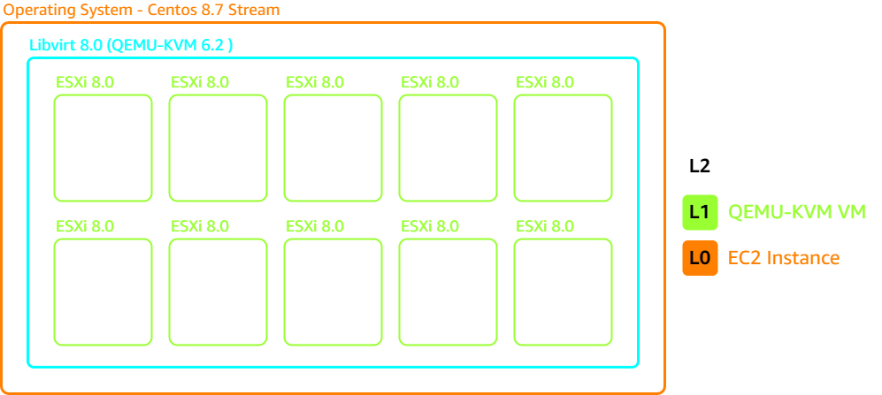
#### -> Centos 8.x Stream is used as the L0 Operating System, from the AWS official AMI
#### -> QEMU-KVM 6.x is used for the L1 Hypervisor, using libvirtd + OpenvSwitch for nested VLANs/routing
#### -> Your choice of vSphere 6.7, 7.0 or 8.0 is installed into QEMU-KVM VMs to act as the L2 Hypervisors
#### -> 2x clusters of 5x ESXi hosts each are created, each cluster has its own vCenter Server Appliance
#### -> NFS exports on the L0 act as the default datastores for the L2 VMs, but VSAN and iSCSI can be enabled optionally
#### -> Designed to run on an m5zn.metal, which is $3.96/hr (on-demand) - great to deploy for an afternoon of labs then terminate
#### -> Several Bitnami appliances (mySQL, etc) are deployed into the ESXi hosts as example L2 VMs
#### -> CPU performance on the L2 VMs is great, but as there are 10x ESXi hosts, those VMs are all <= 2 VCPU each.
#### -> ESXi hosts use 6x e1000s as pnics.  Any individual flow leaving an L1 ESXi VM is therefore limited to 1Gbps.
#### -> Includes userdata script so you can make this a one-click deployment in EC2 with a Launch Template
 

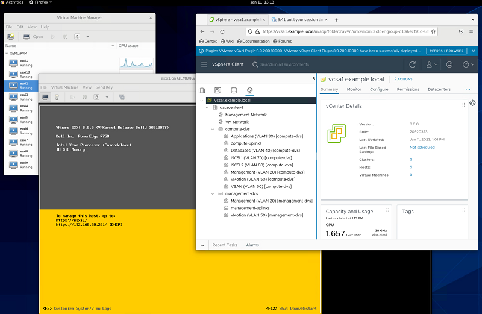
 

# **Deployment Steps** 
[Back to Top](#vSphere-on-AWS-EC2-Baremetal-without-VMC)

NOTE: I realize it is obnoxious to have to separately download these ISOs from VMware, but it would be illegal for me to distribute them myself.  

**1) Download the latest ESXi ISO for either 6.7, 7.0 or 8.0 from VMware or the vExpert site**
----

NOTE: You don't need all three like I have, just whichever one you want to use

*   Known good ESXi vmvisor installer ISOs

    **6.7** = VMware-VMvisor-Installer-201912001-15160138.x86_64.iso

    **7.0** = VMware-VMvisor-Installer-7.0U3g-20328353.x86_64.iso

    **8.0** = VMware-VMvisor-Installer-8.0-20513097.x86_64.iso
        
**2) Download the latest VCSA ISO for either 6.7, 7.0, or 8.0 from VMware or the vExpert site**
----

NOTE: You don't need all three like I have, just whichever one you want to use

Known good VCSA ISOs

**6.7** = VMware-VCSA-all-6.7.0-15132721.iso

**7.0** = VMware-VCSA-all-7.0.3-20990077.iso

**8.0** = VMware-VCSA-all-8.0.0-20920323.iso
  
    * Note: 7.0 is the pickiest of the bunch.  Make sure you use this build as earlier ones have odd SSL issues in the nested environment

**3) Modify the ESXi vmvisor installer ISO to make it do an unattended/kickstart install**
----

*   Using a tool such as [UltraISO](https://www.ultraiso.com/), edit two files.  First is \BOOT.CFG and the second is \EFI\BOOT\BOOT.CFG.  

       

       

*   Both files are identical, and you need to make the same change to both files in all versions of the vmvisor ISO before uploading it to S3.
    * Change this line:
    * kernelopt=runweasel cdromBoot   

        
        
    * To look like this:
    * kernelopt=cdromBoot runweasel ks=http://192.168.20.1/KS.CFG

        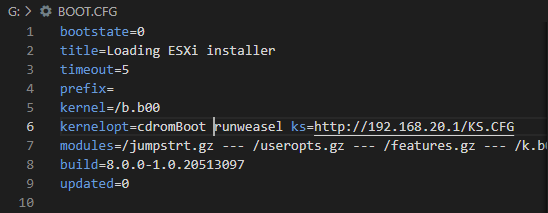

*   Save the files and name them something that clearly shows they are the modified ISOs.  
    *   I use the convention VERSIONNAME.iso in the bash/userdata-example.sh so you should probably stick with that:

        

        NOTE: You don't need all three like I have, just whichever one you want to use

**4) Set up an S3 bucket**
----

*  Upload the VCSA ISOs for 6.7, 7.0, and 8.0 into it
     
     
    

    NOTE: You don't need all three like I have, just whichever one you are going to deploy

*  Upload the **modified ISOs** for ESXI 6.7, 7.0, and 8.0 into it
     
     
    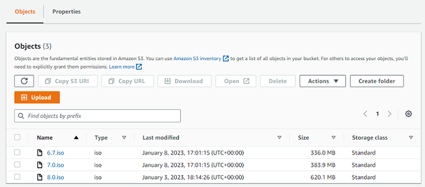

    NOTE: You don't need all three like I have, just whichever one you want to use

**5) Set up a VPC**
----

*  Give it two private and two public subnets (minimum)

    *   The two privates are needed because you will be deploying AWS Managed Active Directory, and that requires two domain controllers on different subnets

    *   The public subnets are needed for your NAT gateway and jump host

*   Deploy at least one NAT Gateway

*   Create two Routing Tables, one for the public and one for the private subnets

    *   Set the Private routing table to use the NAT Gateway as the route for 0.0.0.0/0

    *   Set the Public routing table to use the Internet Gateway as the route for 0.0.0.0/0

    *   Explicitly associate the private subnets to the private route table and the public subnets to the public route table
   
**6) Deploy an AWS Managed Active Directory instance into your VPC**
----

*  Note: The script uses admin@example.local by default.  This means you cant use Simple AD, it has to be the full Managed AD ... well, unless you want to hack the scripts

*  This also means you would be best served setting the DHCP options up for your VPC to point to these for DNS, not the default AWS DNS
     
     
    

**6) Deploy a Windows instance into your VPC to act as a jump host**
----

*  Put it on one of the public subnets and allow 3389 in from the internet

*  Join it to the Active Directory Domain you created in step 6

*  Install PuTTY or whatever SSH client you like

*  Install a VNC client such as RealVNC

**8) Deploy an m5zn.metal to your VPC to be the L0 host**
----

 *  Use the official Centos 8 Stream AMI from AWS
     
     
     

 *  Put it on one of the private subnets

 *  EBS volume - I normally use a 2000 GiB GP3 volume.  
  
    *  You could probably drop this to as low as 500 GiB if you don't plan to do VSAN or thick provision many L2 VMs.  I have not tested to find the low bound.

**9) Under bash/userdata-example.sh there is something you can cut and paste into the user data section that will prepare the L0 host**
----
 *  [bash/userdata-example.sh](bash/userdata-example.sh)

 *  Make sure to fill out the S3BUCKET, S3PREFIX, ADPASSWORD, etc variables at the top appropriately
     
     
     

    What these variables mean:

    *   **S3BUCKET=**
        *   *example:  S3BUCKET=mys3bucketname*
        *   Don't include the https:// or s3:// or any of that.  Just the base bucket name
    *   **S3PREFIX=**
        *   *example:  S3PREFIX=seahow/ISOs*
        *   Don't include the "/" on either side
    *   **DNSIPADDRESS1=**
        *   *example:  DNSIPADDRESS1=10.0.0.111*
        *   This is the first IP address you got when you deployed AWS Managed AD
    *   **DNSIPADDRESS2=**
        *   *example:  DNSIPADDRESS2=10.0.0.74*
        *   This is the second IP address you got when you deployed AWS Managed AD
    *   **VCSAISO=**
        *   *example:  VCSAISO=VMware-VCSA-all-8.0.0-20920323.iso*
        *   This is how you tell it what VCSA ISO to download from S3 and deploy into the nested environment
    *   **VSPHEREVERSION=**
        *   *example:  VSPHEREVERSION=8.0*
        *   This is how you tell it what ESXi ISO to download from S3 and deploy into the nested environment
    *   **DNSDOMAIN=**
        *   *example:  DNSDOMAIN=example.local*
        *   This is your AD Domain name
    *   **ADPASSWORD=**
        *   *example:  ADPASSWORD=Aws2022@*
    *   **ADUSER=**
        *   *example:  ADUSER=admin@EXAMPLE.LOCAL*
        *   NOTE: The domain name needs to be in all caps.  Oddity of realmsd.
    *   **HOSTPASSWORD=**
        *   *example:  HOSTPASSWORD=VMware1!*
        *   The password to set for root on the ESXi hosts themselves
    *   **SSOPASSWORD=**
        *   *example:  SSOPASSWORD=AWS2022@*
        *   Password for administrator@lab1.local and administrator@lab2.local on the VCSAs
  
 *  **This userdata script will**
  
    *  download this git repo to the L0
    *  download the ISOs for the VCSA and ESXi installers to the L0
    *  join the L0 to your Active Directory Domain
    *  install AWS SSM and Cloudwatch agents
    *  inject the variables you set at the top into ./main.sh
    *  disable source-dest-check for the instance's networking
    *  Run ./main.sh which prepares everything right up to the point before you start actually deploying ESX/VCSA/etc

 *  *NOTE: I recommend you create a Launch Template that contains this userdata script pre-filled out.  Makes redeployment of L0 from scratch a lot easier.*

**10) Once the EC2 baremetal instance is deployed, you need to make a couple of modifications to it**
----

 *  Disable the source/dest check (under networking) *[NOTE: Not necessary if you used the bash/userdata-example.sh from Step 9]*
     
     
     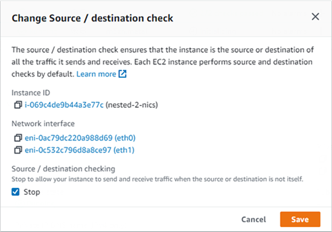

 *  Second, add a route for 192.168.0.0/16 that points to whatever ENI maps to eth0 of your EC2 instance
     
     
     

**11) From your Jump Host, SSH into your EC2 baremetal instance**
----

  *  cd $ESXIROOT

  *  Now kick off the build of the nested environment

      ./nested.sh

      **NOTE: This assumes you used the example userdata script to deploy the L0.  If you did not, you will need to manually run ./main.sh BEFORE ./nested.sh**

 

# **Optional items / tips**
[Back to Top](#vSphere-on-AWS-EC2-Baremetal-without-VMC)

**1) From your Windows Jump Host, VNC to the desktop of your EC2 baremetal instance**
----

  *  One of the scripts ./main.sh runs installs a GNOME desktop and VNC server onto the L0 running on TCP/5911.  This is helpful for troubleshooting, as you can watch the ESXi host consoles while they build for example.
     
     
     

  *  NOTE: It is possible to skip having a Windows jump host by putting your L0 on a public subnet and allowing TCP 5911 inbound.  You can do everything from the L0 desktop.  The reason I don't recommend this by default is most people don't want their L0 right on the internet like that.

**2) From your Windows Jump Host, mount the CIFS shares on your L0**
----

  *  Log in as localhost\root with a password of $ADPASSWORD (whatever you set that to)
     
     
     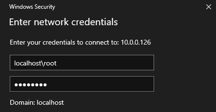

  *  Samba exposes 4 shares 
     *  etc
        *  /etc directory on the L0
     *  html
        *  $ESXIROOT/webserver directory on the L0
     *  logs
        *  /var/log directory on the L0
     *  scripts
        *  $ESXIROOT on the L0
     
     

     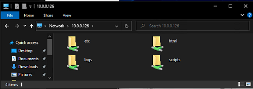   

  *  For example, if you look under **\\\L0IP\scripts\VMs\esxi-hostlogs** you can find things like the vmkernel log from all of your ESXi hosts
     
     

     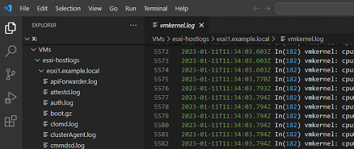   

**3) If you want to redeploy the nested environment without having to redeploy the entire instance**
----

*  bash/flush.sh

    *  This will remove all 10 ESXi VMs from KVM

*  bash/build.sh

    *  This will recreate them plus install the VCSAs, nested VMs, configure DVSes, etc

 

# **Diagrams**
[Back to Top](#vSphere-on-AWS-EC2-Baremetal-without-VMC)

*Click each diagram to see the full size version*

**1) Networking overview**
----

  * Logical overview of networking inside a VPC
    
    [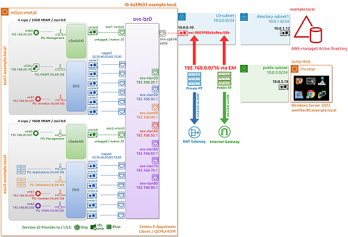](images/networking/network-overview.png)

  * Note that there are 7 pnics on each ESXi host 
    * The first one, vmnic0, is untagged on VLAN 20
      * This pnic is only used while the environment is being built
    * All others, vmnic1-vmnic6, are tagged for all VLANs
      * VLAN 20 = Management VMkernel IPs, vCenter Server Appliances (192.168.20.0/24)
      * VLAN 30 = Application VMs (192.168.30.0/24)
      * VLAN 40 = Database VMs (192.168.40.0/24)
      * VLAN 50 = vMotion VMkernel (192.168.50.0/24)
      * VLAN 60 = VSAN VMkernel (192.168.60.0/24)
      * VLAN 70 = iSCSI VMkernel (192.168.70.0/24)
    * Each VLAN uses .1 as its gateway, which is a virtual port inside ovs-br0 (similar to a Cisco SVI)
      * No firewall rules or routing restrictions are applied on ovs-br0, everything can route freely
  
**2) iSCSI logical**
----

  * If I need to demonstrate a SAN for some reason, I typically deploy a netapp virtual appliance into the second cluster and mount its volumes over iSCSI from the first cluster.
    
    [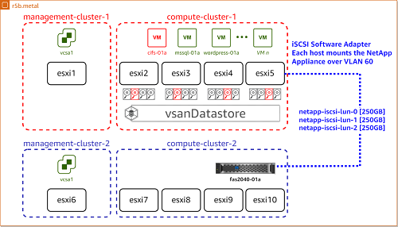](images/networking/esxi-on-kvm-iSCSI.png)

**3) VSAN logical**
----

  * Each ESXi host deploys with 4x unused local SATA disks that can be used to build a VSAN cluster post-deployment
    
    [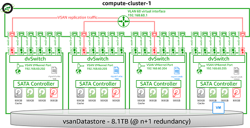](images/networking/esxi-on-kvm-VSAN.png)

 

# **Logs of interest if you have deployment issues**
[Back to Top](#vSphere-on-AWS-EC2-Baremetal-without-VMC)

  * **These log files are created when the EC2 userdata script runs:**
  
    * /var/log/cloud-init.log
    * /var/log/cloud-init-output.log
    * /var/log/join_l0_to_ad.log
     
    If a deployment fails, the first thing to check is if cloud-init.log shows SUCCESS at the bottom

  * **These log files are created when $ESXIROOT/main.sh runs (in this order):**

    * /var/log/configure_l0_env.sh.log
    * /var/log/configure_l0_packages.sh.log
    * /var/log/configure_l0_packages_1.log
    * /var/log/configure_l0_packages_2.log
    * /var/log/configure_l0_packages_3.log
    * /var/log/configure_l0_packages_4.log
    * /var/log/configure_l0_packages_5.log
    * /var/log/configure_l0_packages_6.log
    * /var/log/configure_l0_desktop.sh.log
    * /var/log/configure_libvirt.sh.log
    * /var/log/configure_ovs.sh.log
    * /var/log/insertdnsrecords.sh.log

  * **These log files are created when $ESXIROOT/nested.sh runs (in this order):**
  
    * /var/log/build.sh.log
    * /var/log/configure_vcsas.sh.log
    * /var/log/configure_cluster.sh.log
    * /var/log/configure_dvs.sh.log
    * /var/log/configure_esxi.sh.log
    * /var/log/get_ovas.sh.log
    * /var/log/configure_workload_vms.sh.log

  * **NOTE:** One of the things the sample userdata script does is set up AWS Cloudwatch to ingest these and many other logs into a Log Stream named after the Instance Id.

    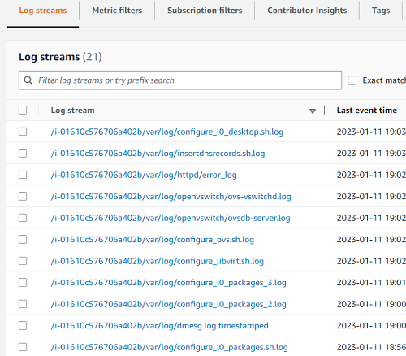

 

# **Errata**
[Back to Top](#vSphere-on-AWS-EC2-Baremetal-without-VMC)

**1) VCLS is disabled by default**
----

  * [bash/configure_cluster.sh](bash/configure_cluster.sh) has a section towards the end that disables VCLS on both clusters in both vcenters.

  * I added this because the vcls control VMs have a weird dependency on a cpuid flag called MWAIT that I can't figure out how to make KVM pass through correctly.  It would also be possible to add some logic to modify the .vmx files of the VCLS control VMs to take that ECX mask out, but because they are named dynamically I haven't had time to add that.  

  * **Downside:** Turning off vcls means you cant use DRS (see [this article for more](https://www.yellow-bricks.com/2020/10/09/vmware-vsphere-clustering-services-vcls-considerations-questions-and-answers/))

  * **Upside:** Your logs won't be full of failed attempts for the VCLS control VMs to boot up

  * **Workaround:**  If you want to use DRS:
     * first change these two values to true in the vCenter's advanced config:
       * config.vcls.clusters.domain-c8.enabled
       * config.vcls.clusters.domain-c10.enabled
    
         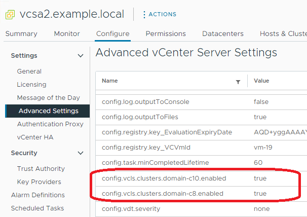  

     * SSH to the vcsa and do "shell service-control --restart vmware-vpxd-svcs" [or just bounce the vcsa]
     * Now edit the VCLS VM's VMX files and set 
       * FeatMask.vm.cpuid.MWAIT = "Val:0"

         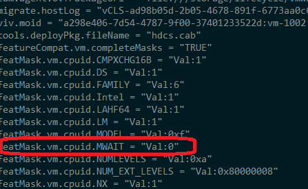  

     * Wait a few minutes and the VCLS control VMs will power up on their own

  * **NOTE:** This only affects 7.0 and 8.0.

 

# **Using the Nested Environment**
[Back to Top](#vSphere-on-AWS-EC2-Baremetal-without-VMC)
 

   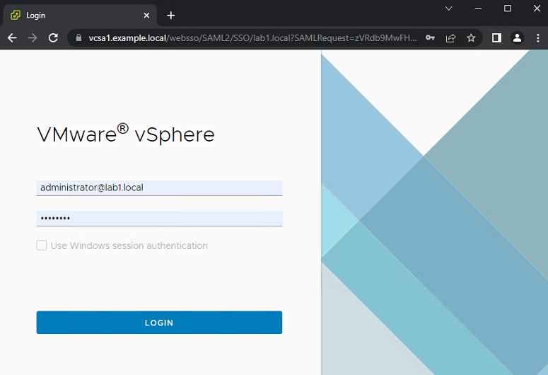

  * log in as administrator@lab1.local (vCSA #1)
  * log in as administrator@lab2.local (vCSA #2)

 

   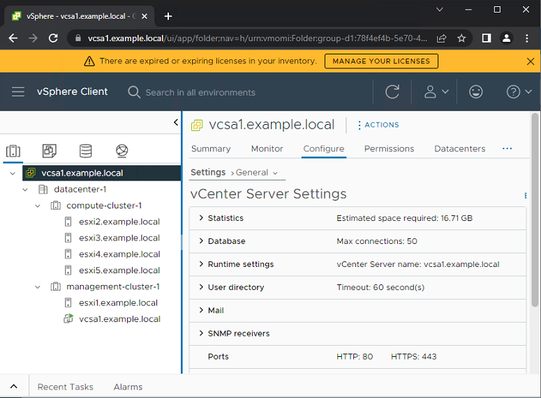

  * esxi1-5 are lab1.local
  * esxi6-10 are lab2.local

 

   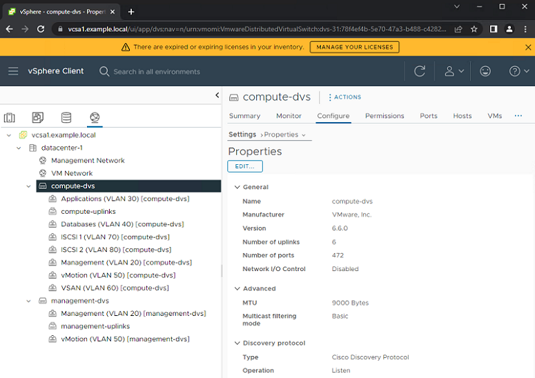
  
  * Each management and compute cluster has its own Distributed Virtual Switch

 

   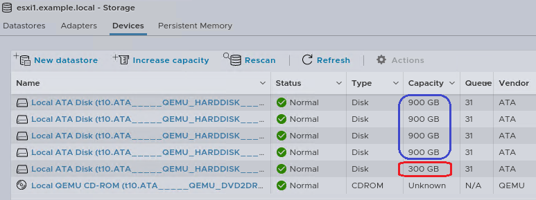

  * Blue = Unused local disks on each ESXi host - these can be used to form a VSAN cluster
  * Red = Local datastore - don't mess with, this is where the vCSA keeps its files